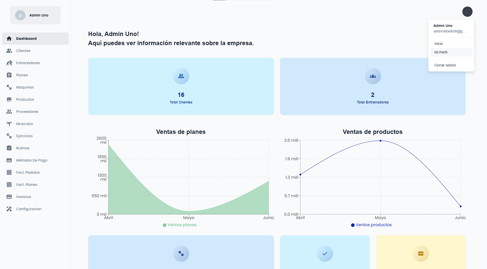

## Bodyhealth Web [(Live)](https://bodyhealth-web.netlify.app/)

> Bodyhealth Web made with Material-UI components and React.

## There are 3 different users
- Administrator
- Coach
- Customer

## Getting started

- Recommended `node js 16.x` and `npm 6+`.
- Install dependencies: `npm install` / `yarn install`
- Start the project: `npm run dev`

## Technologies used

